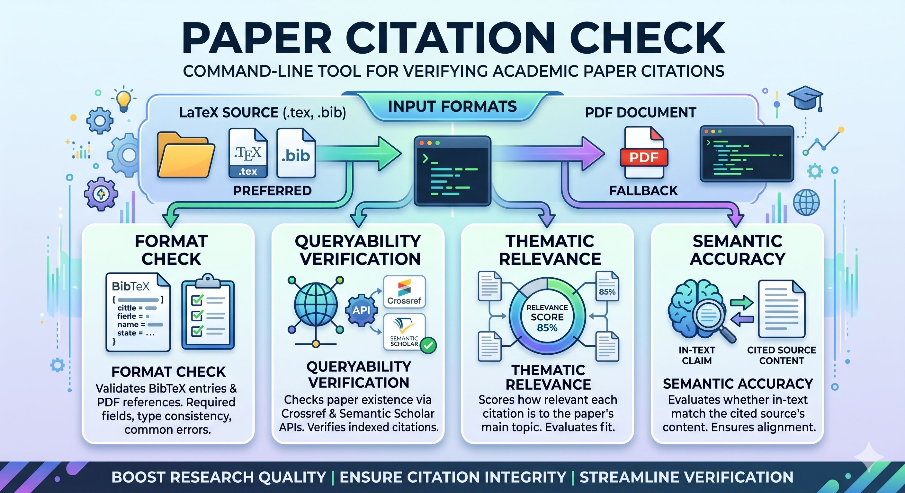

<p align="center">
  
</p>

<p align="center">
  <a href="README.md">English</a> | <a href="README.zh.md">中文</a>
</p>

# CiteCheck — 跨 Agent 学术引用检查 Skill

**一个可移植的 Agent Skill + 独立 CLI 工具，用于验证学术论文引用。**

从 LaTeX 或 PDF 中提取参考文献，验证格式规范，通过 Crossref / Semantic Scholar / OpenAlex / PubMed / arXiv / dblp / Google Scholar / WebSearch 核实论文存在性，并基于引文论文**摘要**评估主题相关性与语义一致性 —— 作为 Skill 使用时**无需任何外部 LLM API Key**。

<p align="center">
  
  
  
</p>

---

## ✨ CiteCheck 是什么？

CiteCheck 首先是一个**跨 Agent Skill**，帮助 AI 编程助手验证论文中的学术引用。它遵循 [agentskills.io](https://agentskills.io) 开放标准，可在 Claude Code、Codex、OpenClaw、Hermes、Gemini CLI、Cursor 等平台上工作。

同时，它也可以作为**独立的 Python CLI 工具**，供喜欢在终端直接运行的用户使用。

> **核心设计原则**：作为 Skill 使用时，主题匹配和语义匹配由宿主 Agent 自身的推理能力完成，不需要 OpenAI API Key。CLI 负责结构化任务（解析、格式检查、API 查询），Agent 负责解释性任务（相关性评分、论断核实）。

---

## 🚀 两种使用方式

### 方式一：Agent Skill（推荐）

将 CiteCheck 安装为 Agent Skill，当你要求检查引用时，Agent 会自动发现并调用它。

**第一步 — 安装 Skill**

> 🟢 **最简单的方式 — 直接让 Agent 帮你装：**
>
> ```
> 帮我安装这个 skill：https://github.com/color4-alt/CiteCheck
> ```
>
> Agent 会自动克隆仓库到正确的 Skill 目录。

如果你希望手动安装：

| Agent | 安装路径 |
|-------|---------|
| **Claude Code** | `~/.claude/skills/citecheck` |
| **Codex CLI** | `~/.codex/skills/citecheck` |
| **OpenClaw** | `~/.openclaw/skills/citecheck` |
| **Hermes** | `~/.hermes/skills/citecheck` |
| **Gemini CLI** | `~/.gemini/skills/citecheck` |
| **Cursor** | `.cursor/rules/citecheck.mdc`（复制 `skills/citecheck/SKILL.md` 内容） |
| **GitHub Copilot** | 将 `AGENTS.md` 追加到 `.github/copilot-instructions.md` |

**第二步 — 调用**

使用自然语言或带文件引用的斜杠命令：

```
/citation-verification @main.tex
/citation-verification @paper.pdf
/citation-verification @path/to/latex_project/
```

或直接告诉你的 Agent：

```
检查这篇论文的引用。
验证我 LaTeX 项目中的参考文献。
这些引用是否准确且相关？
```

Agent 会自动执行：
1. 调用 `citecheck` CLI 解析论文并检查格式
2. 查询 Crossref → Semantic Scholar → OpenAlex → PubMed → arXiv → dblp → Google Scholar → WebSearch 验证论文存在性
3. 使用自身推理能力评估主题相关性和语义准确性
4. 输出结构化 Markdown 报告

> **无需 API Key。** Agent 使用内置的 LLM 能力完成第 3–4 步。

---

### 方式二：独立 CLI

适合偏好命令行或需要集成到 CI 流水线的用户。

**第一步 — 安装 Python 包**

```bash
pip install citecheck-cli
```

如需 PDF 支持：

```bash
pip install citecheck-cli[pdf]
```

或从源码安装：

```bash
git clone https://github.com/color4-alt/CiteCheck.git
cd CiteCheck
pip install -e ".[pdf,dev]"
```

**第二步 — 运行**

```bash
# 检查 LaTeX 项目（推荐）
citecheck path/to/latex_project/

# 检查单个 .tex 文件
citecheck main.tex

# 检查 PDF（降级方案）
citecheck paper.pdf -o report.md

# 跳过在线验证（离线模式）
citecheck main.tex --skip-verification

# 使用外部 LLM 进行匹配（需 --api-key）
citecheck main.tex --api-key $OPENAI_API_KEY
```

**CLI 参数**

```
citecheck [-h] [-o OUTPUT] [--skip-verification] [--skip-semantic] [--api-key API_KEY] [-v] input

位置参数:
  input                 论文路径（PDF、.tex 或包含 .tex + .bib 的目录）

可选参数:
  -o OUTPUT             输出报告路径（默认: citation_check_report.md）
  --skip-verification   跳过所有在线验证（Crossref / Semantic Scholar / OpenAlex / PubMed / arXiv / dblp / Google Scholar / WebSearch）
  --skip-semantic       跳过语义匹配
  --api-key API_KEY     可选的 OpenAI Key（用于 LLM 匹配，省略则回退到启发式规则）
  -v, --verbose         详细输出
```

---

## 📊 工作流程

```
输入 (LaTeX / PDF)
    │
    ▼
┌─────────────────┐
│ 1. 解析论文     │  ← 提取参考文献、引用标记、正文
└────────┬────────┘
         │
    ┌────┴────┐
    ▼         ▼
┌────────┐ ┌─────────────┐
│ LaTeX  │ │ PDF 降级     │
│(.bib)  │ │ (PyMuPDF)    │
└────────┘ └─────────────┘
         │
         ▼
┌─────────────────┐
│ 2. 格式检查     │  ← 验证 BibTeX 字段、类型、来源
└────────┬────────┘
         │
         ▼
┌─────────────────────┐
│ 3. 可查询性验证     │  ← Crossref → Semantic Scholar → OpenAlex → PubMed → arXiv → dblp → Google Scholar → WebSearch
└────────┬────────────┘
         │
         ▼
┌─────────────────────┐
│ 4. 主题匹配评分     │  ← Skill: Agent 推理 | CLI: 启发式/LLM
└────────┬────────────┘
         │
         ▼
┌─────────────────────┐
│ 5. 语义匹配评分     │  ← Skill: Agent 推理 | CLI: 启发式/LLM
└────────┬────────────┘
         │
         ▼
┌─────────────────────┐
│ 6. 生成报告         │  ← Markdown 报告
└─────────────────────┘
```

---

## 📋 报告输出

CiteCheck 生成 Markdown 报告，包含：

- **摘要**：总参考文献数、格式问题数、验证通过数、平均分
- **详细表格**：每条参考文献的格式 / 可查询 / 主题 / 语义状态
- **格式问题**：具体问题（缺失作者、错误条目类型、可疑年份、预印本来源等）
- **查询结果**：Crossref / Semantic Scholar / OpenAlex / PubMed / arXiv / dblp / Google Scholar / WebSearch 验证状态
- **摘要感知语义评分**：语义匹配在可用时使用引文论文的摘要
- **未引用文献**：`.bib` 中从未被 `\cite{}` 引用过的条目

查看完整示例：[`examples/example_report.md`](examples/example_report.md)

---

## 🏗️ 项目结构

```
CiteCheck/
├── skills/citecheck/SKILL.md      ← Agent Skill 入口（跨平台）
├── .claude-plugin/plugin.json     ← Claude Code 市场元数据
├── .codex-plugin/plugin.json      ← Codex CLI 市场元数据
├── CLAUDE.md                      ← Claude Code 项目上下文
├── AGENTS.md                      ← Codex / 通用 Agent 项目上下文
├── GEMINI.md                      ← Gemini CLI 项目上下文
├── src/citecheck/                 ← Python CLI 源码
│   ├── cli.py
│   ├── parser.py
│   ├── bibtex_parser.py
│   ├── pdf_parser.py
│   ├── verifier.py
│   ├── matcher.py
│   ├── models.py
│   └── reporter.py
├── references/                    ← Skill 参考文档
│   ├── format-check-rules.md
│   ├── api-reference.md
│   ├── thematic-scoring-prompt.md
│   └── semantic-matching-prompt.md
├── tests/
├── examples/
└── README.md / README.zh.md
```

---

## 🛠️ 开发

```bash
# 克隆
git clone https://github.com/color4-alt/CiteCheck.git
cd CiteCheck

# 可编辑模式安装（含开发依赖）
pip install -e ".[dev]"

# 运行测试
pytest tests/ -v

# 格式化与检查
black src/ tests/
ruff check src/ tests/
```

---

## 🤝 贡献指南

- 修改 `skills/citecheck/SKILL.md` 时必须保持 **Agent 无关性**（不出现特定品牌名）
- Skill 内容应在 Claude Code、Codex、OpenClaw、Hermes、Gemini CLI 上都能正常工作
- 新增 CLI 功能时，请同时更新 `src/citecheck/cli.py` 和 README

---

## 📝 更新日志

### 0.1.1 (2026-05-28)

**修复**
- PDF 解析器：修复 arXiv 参考文献年份提取 — arXiv ID（如 `arXiv:2004.05150`）曾被误解析为发表年份。现优先匹配引用末尾的年份，并跳过 arXiv ID 模式。
- 验证器（Crossref）：增加标题相似度评分、作者重叠检查、低相似度匹配拒绝。Crossref 现评估全部 3 个候选结果并拒绝相似度 < 0.2 的匹配。

**新增**
- 新增查询源：OpenAlex、PubMed、arXiv、dblp
- Skill 质量改进：外置 prompt 模板、添加示例、修复自包含引用路径

### 0.1.0 (2026-05-27)

- 首次发布至 PyPI

---

## 📄 许可证

MIT License — 详见 [LICENSE](LICENSE)。

